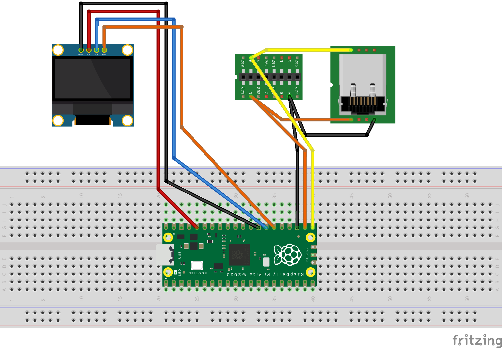

# stowawayPicoUSB

**V1.0**

A company named Think Outside made ingenious foldable keyboards back in the days - this is a small project to send keystrokes from the Stowaway Handspring version to USB via a Raspi Pico.


## Hardware

- Raspberry Pi Pico (5€)
- 8-pin 2.54mm socket and pin-row connector
- SSD1306 display (8€)(optional)
- USB cable

Time to build it: less than half an hour.

## Software

- CircuitPython 9.x
- Adafruit HID library for USB connectivity
- [CircitPython libraries](https://circuitpython.org/libraries) - see below


## How to build it

#### Init Raspi Pico 

- Connect a virgin Raspi Pico to your computer - a **USB drive named ```RPI-RP2``` appears in the file system**
- Download and **copy the Circuit Python .uf2 file to the RPI-RP2 USB drive** - file and instructions here: [Adafruit Page](https://circuitpython.org/board/raspberry_pi_pico/) 
  - You may either use the 9.x or 10.x version of Circuit Python, just be sure to pick the matching libraries in the next step. 
- The Pico reboots now and registers as a USB drive called ```CIRCUITPY``` now. 

#### Connect


- Solder a connection to the pin-row connector
- Solder the pin-row socket to the Stowaway keyboard
- If you want the disply, solder the SDA and SCL connections and power wires

#### Install software

- Get the **Adafruit Library** bundle [(download page)](https://circuitpython.org/libraries)
- Find and copy these libraries to the ```/lib``` folder on the CIRCUITPY drive: 
	- ```adafruit_hid``` folder
	- ```adafruit_displayio_ssd1306```
	- ```adafruit_display_text```
	- ```asyncio```
	- ```adafruit_ticks``` (needed for asyncio)
- **Clone the project** to a local folder (or get the ```src/*.py``` files)
- Copy ```main.py``` and ```stow_kbd.py``` to CIRCUITPY root folder.

You may have to erase the ```code.py``` default script from the folder.


If you connect the Pico to USB now, the display powers up, and the keyboard listens to keystrokes. 

All the interpretation is handled by the computer the USB bus is plugged into, with one exception - see below. 

## The code

is a partly vibe-coded crude proof-of-concept to scan the keyboard, convert the scancodes to USB keycodes, show keypresses on the display, and send them via USB.

All the nasty stuff - picking the keyboard layout, repeating keystrokes for keys that are being held, and interpreting SHIFT or other modifiers - are done by the USB host. **With one exception:** Combinations of a pressed Fn key with a number key are caught and converted to **FN1..FN10 keys**. 

### ```stow_kbd.py```

has the ```KeyboardReader``` class. Most important methods besides ```start()``` and ```stop()``` are: 

- ```read()``` - returns scancode buffer
- ```read_one()``` - reads one scancode byte from buffer, filtering the second byte from a "all keys up" message
- ```get()``` - reads scancode buffer, converts to keycode, and sends kbd.press() or kbd.release() message, returning scancode and keycode. 

The code has several keymaps; the ones containing actual character strings (```STOWAWAY_KEYMAP_US```, ```STOWAWAY_KEYMAP_DE```) are for displaying keys on the display, and are not used right now. The keymap that tells the code which keycode to send is the ```ADAFRUIT_KEYMAP```.

### ```main.py```

- initialises the SSD1306 display, using the ```adafruit_displayio_ssd1306``` library [(docs)](https://docs.circuitpython.org/projects/displayio_ssd1306/en/latest/) which outputs nice status text on a 21x4 character window.

*Note*: If the code does not set a display root group (you can comment out the ```display.root_group = splash``` line in ```setup_display```), the display mirrors the terminal. Meaning that you can use simple ```print()``` commands to show the status, as the REPL terminal is mirrored - but with a status line which you presumably can't get rid of. 

- So there is a ```cprint()``` routine which outputs text to the terminal and to the display in parallel.
- has a wrapper for the ```KeyboardReader```, starting the routine and using ```KeyboardReader.get()``` to send keypresses to USB. The scancode and keycode are printed to the display. 

### Todo

Problems to fix: 

- Doesn't catch the auto-repetitions as suggested in the Stowaway documentation

Nice-to-have: 

- Timeout: if no key has been pressed for a while, power-cycle the keyboard

### Documentation

- [Raspberry Pi Pico Pinout](https://www.elektronik-kompendium.de/sites/raspberry-pi/2611051.htm)
- [Think Outside Targus Stowaway Handspring Documentation (PDF)](./stowaway_handspring.pdf) (Note: as the company no longer exists, I consider this to be abandonware) 

## License

As this project relies heavily on Adafruit's CircuitPython libraries, which are under a MIT license, this project is published under the **[MIT LICENSE](./LICENSE) (2025) untergeekDE** as well. 

